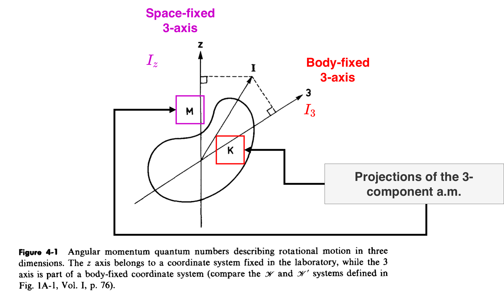

# Degrees of freedom associated with spatial rotations

- Rotational motion about a fixed axis -> **rotational motion in two dimensions**
- The 2D rotation implies only two parameters that are used to describe this kind of motion: `a)` the azimuthal angle $\phi$ -> **orientation of the system** and `b)` the state of the motion given by the eigenvalue $M$ of the total angular momentum. Per the two parameters, the expression of the associated wave function is as follows: ![[Pasted image 20210821145532.png]]
- Taking the rotational motion in 3D, the orientation of the nuclear body involves three parameters: **the Euler angles**
- Moreover, for the 3D rotation of the nuclear system, three quantum numbers are required for the state of motion. These three quantum numbers are :
	- the total angular momentum $I$
	- the $M$ component on the *space-fixed axis*-$I_z$ (space-fixed coordinate system)
	- the $K$ component of the *body-fixed axis*-$I_3$ (body-fixed coordinate system)
		- The third quantum number can be obtained by considering the components of $\vec{I}$ w.r.t. to *the intrinsic* (or body-fixed) coordinate system with given **orientation** $\omega$.
		- The diagram shown below aims at depicting the difference between the intrinsic coordinate system and the space-fixed (or the *laboratory*) system. 
  
  