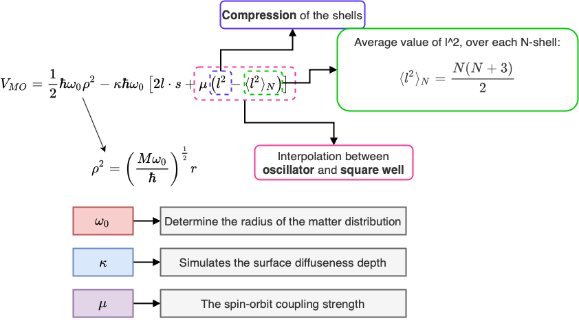

# The nuclear one-particle potential in the spherical case

The task at hand is to find the solution/wave-function of the following Hamiltonian:

$$ H=-\frac{\hbar^2}{2M}\Delta^2+V(r)$$
where $V(r)$ is to represent the *nuclear one-body* potential (the one-body field), and $M$ is the average nucleon mass. Using the spherical symmetry and working in the spherical coordinates, one can exploit the symmetries involved in order to postulate a potential candidate to the solution; namely the function $\psi=R(r)Y_{lm}(\theta,\varphi)$, where $Y_{lm}$ is an eigenfunction of the angular momentum operator $l^2$. ![[Pasted image 20210804092358.png]]

The Schrodinger equation for the radial wave function $R(r)$ is given by the following expression: ![[Pasted image 20210804092534.png]]

- A common type of radial potential is the Woods-Saxon potential: ![[Pasted image 20210804092608.png]]. However, the Schrodinger can only be **solved numerically** for this kind of potential.
- The WS potential falls somewhere between the **harmonic oscillator** and the **finite square well** potentials

### Harmonic oscillator potential

- there is a degeneracy in addition to that caused by the spherical symmetry
- By a *remarkable coincidence*, the second root $2s$ for $l=0$ of the potential exactly coincides with the first root $1d$ of the $l=2$ potential
- This coincidence is understood in terms of the $SU_3$ group. See more details about the $SU_3$ group [here](../../Research-Materials/su3.pdf).

### Infinite square-well potential

- The $l$-degeneracy of the oscillator shells is split such that the $1d$ falls below $2s$, $1g$ below $2d$, the latter in turn below $3s$
- The splitting can be understood if one considers the effective radial potential where the **centrifugal potential** has been added to $V(r)$: $$V_\text{eff}=V(r)+\frac{\hbar^2}{2Mr^2}l(l+1)$$
- The potential above enters in the separated radial equation
- The level ordering in the Woods-Saxon case falls somewhere between the two extremes, the soft-surface harmonic oscillator, and the hard-surface square well. The same level ordering is obtained y the addition of a term $$V_\text{corr}=-\mu'\hbar\omega_0l(l+1)$$ to the harmonic oscillator potential.
- ![[Pasted image 20210804123001.png]] ![[Pasted image 20210804123014.png]] ![[Pasted image 20210804123042.png]]

## Spin-orbit term

- One required task is to reproduce the energy gap for 50 protons or neutrons.
- This can be achieved if the 1g-shell splits into $g_{9/2}$ and $g_{7/2}$
- In a similar way, the splitting of the 1h-shell into $h_{11/2}$ and $h_{9/2}$ leads to a gap for a particle number of 82, and so on.
- The energy thus depend on whether $l$ and $s$ (vectors) are **parallel** or **anti-parallel**.
- A term in the potential that takes into account this coupling was introduced by Haxel, Jensen, Siiss and M.G. Mayer.
- A spin-orbit term of this type was know in the electron shell
	- Source of this term is the coupling energy of the electron in the intrinsic magnetic field seen by the electron
	- The electron moving with velocity $\vec{v}$, it experiences a magnetic field $\vec{B}$, proportional to $\vec{v}\times\vec{E}$: $$\vec{B}=\epsilon_0\mu_0\vec{v}\times\vec{E}$$
- In the nuclear case there is indeed also such a term of electromagnetic origin
	- The nuclear spin-orbit however, is of strong-interaction origin, and it can be understood from details of two-body interaction
	- The nuclear forces must preserve **parity**, which requires that the nuclear potential is a scalar
	- The simplest conceivable scalar that contains the vector $\vec{s}$ seems to be $$V_{LS}\propto \vec{s}\cdot(\vec{p}\times\nabla V)$$ 
	- For a spherical symmetry we have: $$\nabla V=\frac{\vec{r}}{r}\frac{\partial \vec{V}}{\partial r}$$
	- or $$V_{LS}\propto\frac{1}{r}\frac{\partial V}{\partial r}\vec{s}\cdot\vec{l}$$
	- For the pure harmonic oscillator case, the spin-orbit term becomes simple: $$\frac{1}{r}\frac{\partial V}{\partial r}=M\omega_0^2=\text{const.}$$
	- The calculation of the splitting caused by the spin-orbit term in the potential $V_{LS}$ requires the construction of new wave-functions that are eigenfunctions of $\vec{l}\cdot\vec{s}$.

#axial-vector -> ![[Pasted image 20210804145628.png]]

### Obtaining the degeneracy induced via the spin-orbit coupling

- Start with $$\vec{l}+\vec{s}=\vec{j}$$ and furthermore, $(\vec{l}+\vec{s})^2=\vec{j}^2$, i.e., $$\vec{l}\cdot\vec{s}=\frac{1}{2}\left(\vec{j}^2-\vec{l}^2-\vec{s}^2\right)$$
- There exists a possible way of constructing wave-functions for which $l$, $j$ and $s$ are **good quantum numbers**, and therefore $\vec{l}\cdot\vec{s}$ is an **eigenoperator**.

Results:

$$\vec{l}\cdot\vec{s}\to\frac{1}{2}[j(j+1)-l(l+1)-s(s+1)]$$

and: 

![[Pasted image 20210804150639.png]]

> **Observation:** Out of the $2\cdot(2l+1)$ states with a given $l$, one can form one group of states with $j=l+\frac{1}{2}$ and oe with $j=l-\frac{1}{2}$. $2j+1=2l+2$ for the former and $2j+1=2l$ for the latter.

- These two groups separate energy-wise. 

> **Example:** the $g$-shell withh a degeneracy $2(2l+1)=18$ splits up into $g_{9/2}$ (degeneracy 10) and $g_{7/2}$ (degeneracy 8)

## Realistic nuclear one-body potentials

With the addition of the spin-orbit term, the Woods-Saxon (WS) potential takes the form:
$$V_{WS}=V(r)+V_{LS}+V_C$$

with ![[Pasted image 20210804151250.png]] and ![[Pasted image 20210804151257.png]], where $V_{SO}$ was used to indicate that one might choose the radial function entering into $V_{LS}$ somewhat different from the central potential $V(r)$.

The Coulomb potential, $V_C$, enters only for protons and it is generated a charge $(Z-1)e$, which is uniformly distributed inside the nuclear volume (or possibly with a diffuse surface).

In practice, the main disadvantage of the WS potential is that it cannot be solved analytically. 

However, the **modified harmonic oscillator potential** (Nilsson 1955):
![[Pasted image 20210804154207.png]]

- The past term has the effect of interpolating between the oscillator and the square well, reproducing effectively the WS radial shape
- The $l^2$ term would result in a general compression of the shells
- The average value of $<l^2>$ taken over each $N$-shell is subtracted ![[Pasted image 20210804154344.png]]

## Key aspects regarding degeneracy in the 1-particle spherical potential

- The degeneracy of an $N'$-shell is $$(N'+1)(N'+2)$$
- The first parameter of the modified HO potential is $\omega_0$
- The radial coordinate of the nuclear wave function is $(M\omega_0/\hbar)^{1/2}\cdot r$
- The **characteristic oscillator length** is $(\hbar/M\omega_0)^{1/2}$.
- From the wave functions one can calculate the total nuclear density as a sum of all the single-particle densities from which the average radius could be studied and compared with experiments